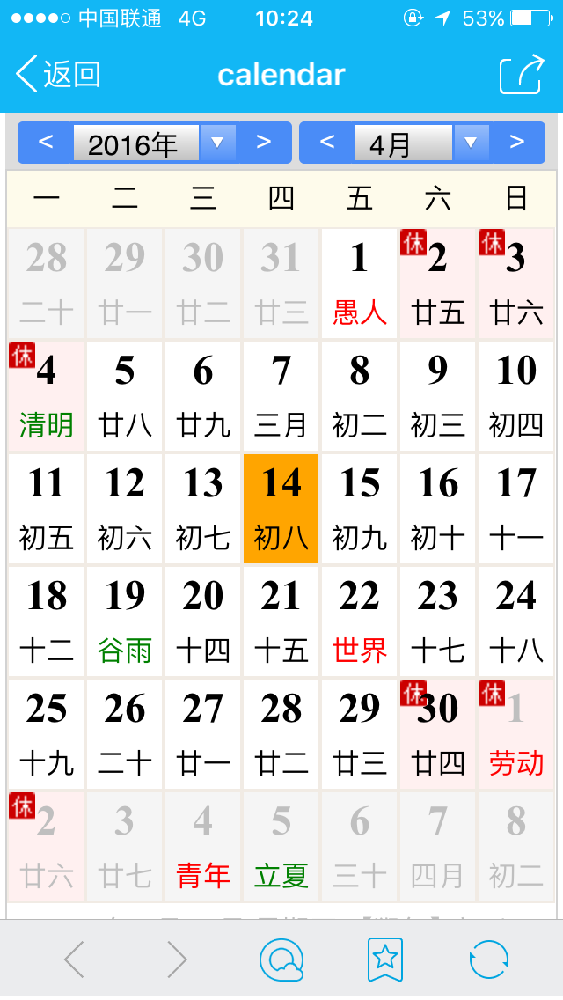

# 项目使用
### install dependecies
```
npm install # or yarn install
```

### start app
```
npm start
```

### 文件说明


### 项目介绍

# 1.目录结构
```
calendar
	|-src(源码目录)
		|-index.html
		|-css
			|-grid.css
			|-main.css
		|-js
			|-calendar-controller.js
			|-calendar-core.js
			|-calendar-tpl.js
			|-calendar-ul.js
	|-dist(合并JS和CSS之后的输出目录)
		|-index.html
		|-css
			|-index.css
		|-js
			|-index.js
		
```
# 2.设计思路

## 2.1 模式的选择
在进行编码之前，我首先考虑的是应该如何组织代码，方便功能的扩展。后来，觉得使用命名空间模式比较合适，因为使用命名空间模式，只会暴露一个全局对象```Calendar```，尽可能的减小全局对象的污染，此外，在添加新的模块时，只需要调用```Calendar.namespace()```方法便可，把具有相同或者相似功能的方法添加到同一个命名空间之上，每个命名空间单独写在一个js文件里面，有点儿模块化的感觉，具有较好的扩展性。最后，添加到命名空间上的都是一些工具类方法，是一些静态方法，不用new关键字进行实例化即可直接调用，比较方便。在这个作品中，我一共生成了5个命名空间，分别是Calendar(基空间，只有namespace一个方法定义在这里)，Calendar.core(跟日历的计算有关的核心方法都定义在这里)，Calendar.tpl（定义了一个进行字符串模板替换的方法），Calendar.ui(跟日历的UI有关的方法都定义在这里)，```Calendar.controller```(跟用户交互有关的，比如各种事件的监听以及程序的初始化)。.

## 2.2布局的选择
选择了命名空间模式，基本解决了如何组织js代码的问题，接下来要考虑CSS布局的选择。日历表有6行7列共42个格子，使用table布局可能是一个很好的选择，但是，我却没有使用table,主要是因为table布局不够灵活，而且默认样式不好看，在不同浏览器之间还渲染得不一样。以前做项目用过bootstrap，觉得它的grid栅格系统很棒，所以，就自己模仿写了一个简单的基于浮动布局的栅格系统。在css/grid.css文件里面可以看到。

## 2.3公历转农历
公历转农历的算法是比较复杂的，所以，编码前的第一件事就是要把转换规律弄懂。通过搜查资料，我知道了公历与农历的转换关系不是一个简单的公式就可以完成，其中的转换比较复杂，比较常用并且比较简单的公历转换农历算法就是查表方法。
首先要保存公历农历的转换信息：以任何一年作为起点，把从这一年起若干年的农历信息保存起来，我从网上找到了1900年到2050年之间的。要保存一年的信息，其实只要两个信息就可以了：(1)、农历每个月的大小；(2今年是否有闰月，闰几月以及闰月的大小。用一个整数来保存这些信息就足够了。具体的方法是：用一位来表示一个月的大小，大月记为1，小月记为0，这样就用掉了12位，再用低四位来表示闰月的月份，没有闰月记为0。比如说，2000年的信息数据是0x0c960，转化成二进制就是1100 1001 0110 0000，表示的含义是1、2、5、8、10、11月大，其余月小，低四位为0说明没有闰月。2001年的农历信息数据是0x0d954，其中的4表示该年闰4月，月份大小信息就是0x0d95，具体的就是1、2、4、5、8、10、12月大，其余月小。这样就可以用一个数组来保存这些信息。在我的代码中使用了lunarInfo这个数组来保存这些信息的。如下：
```javascript
		var lunarInfo = [
			0x04bd8,0x04ae0,0x0a570,0x054d5,0x0d260,0x0d950,0x16554,0x056a0,0x09ad0,0x055d2, 
			0x04ae0,0x0a5b6,0x0a4d0,0x0d250,0x1d255,0x0b540,0x0d6a0,0x0ada2,0x095b0,0x14977, 
			0x04970,0x0a4b0,0x0b4b5,0x06a50,0x06d40,0x1ab54,0x02b60,0x09570,0x052f2,0x04970, 
			0x06566,0x0d4a0,0x0ea50,0x06e95,0x05ad0,0x02b60,0x186e3,0x092e0,0x1c8d7,0x0c950, 
			0x0d4a0,0x1d8a6,0x0b550,0x056a0,0x1a5b4,0x025d0,0x092d0,0x0d2b2,0x0a950,0x0b557, 
			0x06ca0,0x0b550,0x15355,0x04da0,0x0a5d0,0x14573,0x052d0,0x0a9a8,0x0e950,0x06aa0, 
			0x0aea6,0x0ab50,0x04b60,0x0aae4,0x0a570,0x05260,0x0f263,0x0d950,0x05b57,0x056a0, 
			0x096d0,0x04dd5,0x04ad0,0x0a4d0,0x0d4d4,0x0d250,0x0d558,0x0b540,0x0b5a0,0x195a6, 
			0x095b0,0x049b0,0x0a974,0x0a4b0,0x0b27a,0x06a50,0x06d40,0x0af46,0x0ab60,0x09570, 
			0x04af5,0x04970,0x064b0,0x074a3,0x0ea50,0x06b58,0x055c0,0x0ab60,0x096d5,0x092e0, 
			0x0c960,0x0d954,0x0d4a0,0x0da50,0x07552,0x056a0,0x0abb7,0x025d0,0x092d0,0x0cab5, 
			0x0a950,0x0b4a0,0x0baa4,0x0ad50,0x055d9,0x04ba0,0x0a5b0,0x15176,0x052b0,0x0a930, 
			0x07954,0x06aa0,0x0ad50,0x05b52,0x04b60,0x0a6e6,0x0a4e0,0x0d260,0x0ea65,0x0d530, 
			0x05aa0,0x076a3,0x096d0,0x04bd7,0x04ad0,0x0a4d0,0x1d0b6,0x0d250,0x0d520,0x0dd45, 
			0x0b5a0,0x056d0,0x055b2,0x049b0,0x0a577,0x0a4b0,0x0aa50,0x1b255,0x06d20,0x0ada0
		]; 
```

## 2.4 如何在42个格子显示日期
解决了公历转农历的问题后，就开始考虑如何在6行7列一共42个日期格子的表格上显示日期了。42个日期格子如下：

 
要在日历表里完整的显示一个月的日期，只需要两个信息就够了：
######1.这个月的第一天是星期几？
######2.这个月的一共有几天？
对于第一个问题，可以通过Date.prototype.getDay方法求出来。比如，求2016年4月第一天是星期几？可以var day = new Date(2016, 3, 0).getDay();就会返回4，表示第一行第5个格子，对应星期五。对于第二问题，是有规律的，如1，3，5，7，8，10，12为大月有31天，4，6，9，11为小月30天，而2月是比较特别的，平年28天，闰年29天，所以需要进行判断的。知道了一个月的第一天是星期几和这个月的天数，日期显示就基本解决了。比如4月份有30天，第一天星期五，所以从第一行的第5个格子填上1，然后递增，直到30就停止，如图:
 
OK,本月的日期已经填充完成了，但是，在1号的前面和30号的后面还有空格啊。所以还要把3月最后4个日期填写到4月1号前面的4 个空格，把5月的前面8个日期填充到4月30号的后面的8个空格子。这可以计算出来的。但是有临界条件要注意的，如果当前月份是1月的话，它的上个月就是上一年的12月的了，同理，如果，当前月份为12月的话，它的下个月就是下一年的1月的了。编码的时候需要注意这个临界条件。

## 2.5 年份和月份的切换
所谓万年历，用户经常会查询其他月份或者其他年份的日期信息的。这就要求日历要具备切换年份和月份的功能。切换年份相对来说是比较容易的，只需让年份值加1或减1即可，不过也有临界条件，年份的值需要在1900-2050之间。切换月份是比较复杂一些，因为，切换月份有可能会同时切换年份，比如，当前月份已经是1月了，用户继续查找上个月，这就要跳到上一年的12月份了，这时候了不仅仅是月份值减1那么简单了，而是应该变成12，同时年份值也要相应的减1。同理，如果当前月份已经是12月了，用户继续查找下个月，这就要跳到上一年的12月份了，这时候了不仅仅是月份值加1那么简单了，而是应该变成1月，同时年份值也要相应的加1。
切换年份，在用户界面上有两种方法，如下图，一种是直接在下拉框里面选择指定的年份，另一种是通过下拉框两边的按钮进行切换，左边的表示切到上年，右边切到下年。切换月份有3种方法，除了2种和切换年份相同的之外，还有一种是直接通过点击日历表格里的日期进行切换，如下图，如果点击4月1号前面的31号，就会切换到3月份去的，这样的用户体验是比较好的。 

## 2.6 如何显示各种节假日和24节气？
很多时候用户想要使用日历来查看某个节日或节气所在的具体的日期，或者看看法定假期有哪些，所以，在日历里面显示各节日、节气、法定假期是很有必要的。

对于显示24节气，是有点复杂的，因为它的日期是不固定的，既不是固定的公历日，也不是固定的农历日。不过，它也有一个规律，就是每个月都是有2个节气，所以，在切换年份或者月份时，只要查找某年某月的两个节气的具体日期即可。我在Calendar.core命名空间上定义了一个getDateOfSolarTerm方法，通过传入年份和月份值，可以得到该月两个节气对应的具体的公历日.

对于显示公历节日是比较简单的，我是把一年之中所有的公历节日的日期和名字放到一个叫做solarFestival的数组里面，如下：
 ```javascript
		var solarFestival = [
			{date: "1,1", fName: "元旦"},
			{date: "2,14", fName: "情人节"},
			{date: "3,8", fName: "妇女节"},
			{date: "3,12", fName: "植树节"},
			{date: "3,15", fName: "消费者权益日"},
			{date: "4,1", fName: "愚人节"},
			{date: "4,22", fName: "世界地球日"},
			{date: "5,1", fName: "劳动节"},
			{date: "5,4", fName: "青年节"},
			{date: "5,12", fName: "护士节"},
			{date: "5,18", fName: "国际博物馆日"},
			{date: "6,1", fName: "儿童节"},
			{date: "6,5", fName: "世界环境日"},
			{date: "6,24", fName: "国际奥林匹克日"},
			{date: "6,23", fName: "世界骨质疏松日"},
			{date: "7,1", fName: "建党节"},
			{date: "8,1", fName: "建军节"},
			{date: "9,3", fName: "抗战胜利纪念日"},
			{date: "9,10", fName: "教师节"},
			{date: "9,18", fName: "孔子诞辰"},
			{date: "10,1", fName: "国庆节"},
			{date: "10,6", fName: "老人节"},
			{date: "10,24", fName: "联合国日"},
			{date: "11,17", fName: "世界学生日"},
			{date: "12,24", fName: "平安夜"},
			{date: "12,25", fName: "圣诞节"}
		];	
 ```
如1月1日元旦节，表示成```{date: "1,1", fName: "元旦"}```,切换月份时，通过这个数组去和日历的公历辅助数组solarDates进行比较就行了。

显示农历节日信息跟公历节日信息是差不多的，只不过是把一年所有的农历节日放到一个叫做lunarFestival的数组里面，如下：
```
		var lunarFestival = [
			{date: "十二月,三十", fName: "除夕"},
			{date: "正月,初一", fName: "春节"},
			{date: "正月,十五", fName: "元宵节"},
			{date: "二月,初二", fName: "龙抬头"},
			{date: "五月,初五", fName: "端午节"},
			{date: "七月,初七", fName: "七夕节"},
			{date: "七月,十五", fName: "中元节"},
			{date: "八月,十五", fName: "中秋节"},
			{date: "九月,初九", fName: "重阳节"},
			{date: "十月,初一", fName: "寒衣节"},
			{date: "十月,十五", fName: "下元节"}
		];
```
 
切换月份时，通过这个数组去和日历的农历辅助数组lunarDates进行比较就行了。

还有一种节日是比较特别的，是以某月的第x个星期n为标准的。因为，这种节日主要3个，分别是父亲节、母亲节和感恩节。我在命名空间Calendar.ui上定义了一个addWeekFestival方法，通过枚举的方法来找出其具体的日期。

# 3. 日历的安装及使用
### 安装：
在calenar根目录下建一个html文件，然后把build子目录下面的mini-calendar.css和mini-calenar.js引入来，并且在body的底部插入一段js，调用Calendar.calendar.init()进行初始化即可,如下，日历会作为body的整个内容插入，并且会覆盖body之前的所有内容，所以，如果不希望日历占据整个body的话，,可以在body里面添加一个空的元素，在这个空元素里面插入:
```html
<!DOCTYPE html>
<html lang="en">
<head>
	<meta charset="UTF-8">
	<meta name="viewport" content="width=device-width">
	<title>calendar</title>
	<link rel="stylesheet" href="build/mini-calendar.css">
 	<script src="build/mini-calendar.js"></script>	 
</head>
<body>
	<script>
		//初始化日历，以body作为容器
		var container = document.body;
		Calendar.controller.init(container);
	</script>
</body>
</html>
```
 
### 扩展API：
如果想要为日历添加新的功能，可以通过Calendar.namespace()方法创建一个新的命名空间，或者在已有的命名空间上添加新的方法即可。


# 4. 在各种主流浏览器的下的浏览效果
### 桌面浏览器： 
Chrome(v48):

 
### 移动设备：
IPhone(qq浏览器):


IPad (Safari):


